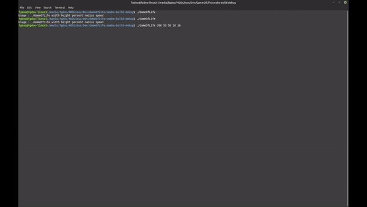

# GameOfLife in Terminal

## Intro
This project is coded in C++ just using the terminal for output.
It uses the ANSI escape codes for moving the cursor around

## Usage
```bash
./GameOfLife width height percent radius speed
```

|Property|Description|
|---|---|
|width|Width of the area|
|height|Height of the area|
|percent|Spawn rate of the cells on initiation|
|radius|Radius of spawn on initiation|
|speed|Frequency of actualisation in Hz|

## Example

```bash
./GameOfLife 200 50 50 20 10
```

## Build project
This project is using cmake. If you want to use simply build with make, do this following commands :
```bash
mkdir build
cd build
cmake -G "Unix Makefiles" ../
./GameOfLife 200 50 50 20 10
```
You can replace the _"Unix Makefiles"_ by an other build system like _"Visual Studio 17 2022"_.\
See the list on [cmake-generators](https://cmake.org/cmake/help/latest/manual/cmake-generators.7.html).

## Sources
- [ANSI Escape Sequences](https://gist.github.com/fnky/458719343aabd01cfb17a3a4f7296797)
- [Unicode caracters for Box](https://en.wikipedia.org/wiki/List_of_Unicode_characters#Box_Drawing)
